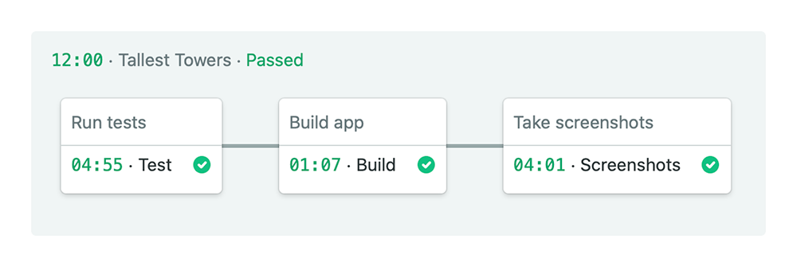

# Semaphore CI for iOS

This sample iOS application includes a basic CI pipeline demonstrating how to build and test an iOS app with [Semaphore CI](https://semaphoreci.com). This project requires Xcode 11.1, and is written in Swift 5.1 using SwiftUI.

## Running the sample app and tests locally

To run the sample application locally in Xcode, clone this repository and open `TallestTowers.xcodeproj`. Then, select an installed simulator and choose "Run" from the "Product" menu or press ⌘R.

This project also includes both unit, and UI tests. To run all tests locally, choose "Test" from the "Product" menu or press ⌘U.


## Set up code signing

Before you run the sample app on a real device or on Semaphore, you'll need to configure code signing.

First, you'll will need to configure the Xcode project to use your development team. Open `TallestTowers.xcodeproj` and set the development team for each of the `TallestTowers`, `TallestTowersTests`, `TallestTowersUITests`, and `TallestTowersScreenshots` targets as follows:

1. Select the `TallestTowers` project in the Project navigator.
2. Switch to the "Signing & Capabilities" tab.
3. Select each target in turn and select a valid development team in the "Signing" settings.

Then, open the `Matchfile` in the `fastlane` folder and make the following edits:

1. Set the `git_url` to an empty, private git repository that you have access to, and that can be used to store encrypted certificates and provisioning profiles for this example app.
2. Set the `username` to the email address for your Apple developer account.

Finally, generate ad hoc signing certificates and provisioning profiles. Open Terminal and run:

```shell
bundle exec fastlane match adhoc
```

## Running the CI pipeline locally

Now that code signing is configured, you should be able to test the CI pipeline locally. A sample `Fastfile` has been included in this project which is configured to:

* `build`: Build the app and archive an ad hoc IPA file.
* `test`: Build the app and run the unit and UI tests.
* `screenshots`: Build the app and generate App Store screenshots.

To run the CI pipeline locally, execute the following commands from the project directory in Terminal:

```shell
bundle install --path vendor/gems
bundle exec fastlane build
bundle exec fastlane test
bundle exec fastlane screenshots
```

At this point, if everything is configured correctly you should have a `TallestTowers.ipa` file in the project root and a `screenshots` directory containing App Store screenshots.

## Running the CI pipeline on Semaphore

To run the CI for this sample app on Semaphore, fork this repository and add it as a new project from [your Semaphore dashboard](https://id.semaphoreci.com/init_auth).

Semaphore pipelines are made up of blocks executed in sequence that are configured in a `.semaphore/semaphore.yml` file in the root of your project. The [pipeline configuration for this sample project](.semaphore/semaphore.yml) is fully commented, and has been configured to run all tests, build and archive the application as an IPA file, and generate App Store Screenshots. The IPA archive and App Store screenshots are all uploaded as [artifacts](https://docs.semaphoreci.com/article/155-artifacts).

For more information on the full cabilities of the `semaphore.yml` configuration file, [see the documentation](https://docs.semaphoreci.com/article/50-pipeline-yaml).



This sample Semaphore configuration uses an `a1-standard-4` machine running macOS Mojave with [Xcode 11.1, fastlane and other build tools pre-installed](https://docs.semaphoreci.com/article/162-macos-mojave-xcode-11-image). Other, larger machine types are [available if needed](https://docs.semaphoreci.com/article/20-machine-types).

**Important Note:** If you receive the error message "Selected machine type is not available in this organization" after setting up this sample project on Semaphore, ensure your account is on the Semaphore Pro plan. A 14 day free trial of this plan is available from your dashboard.

## License

Copyright ©2019 Rendered Text – Distributed under the MIT License. See the [LICENSE](LICENSE) for full terms.
